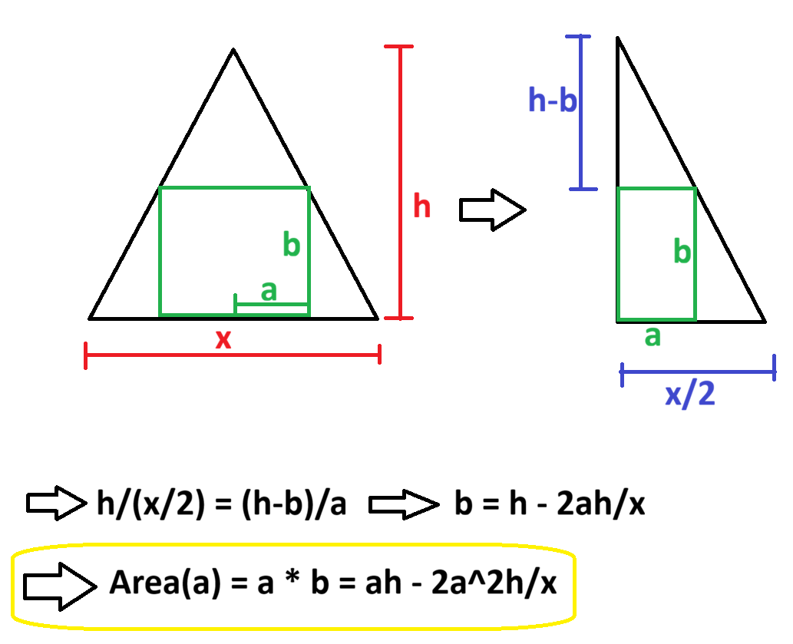
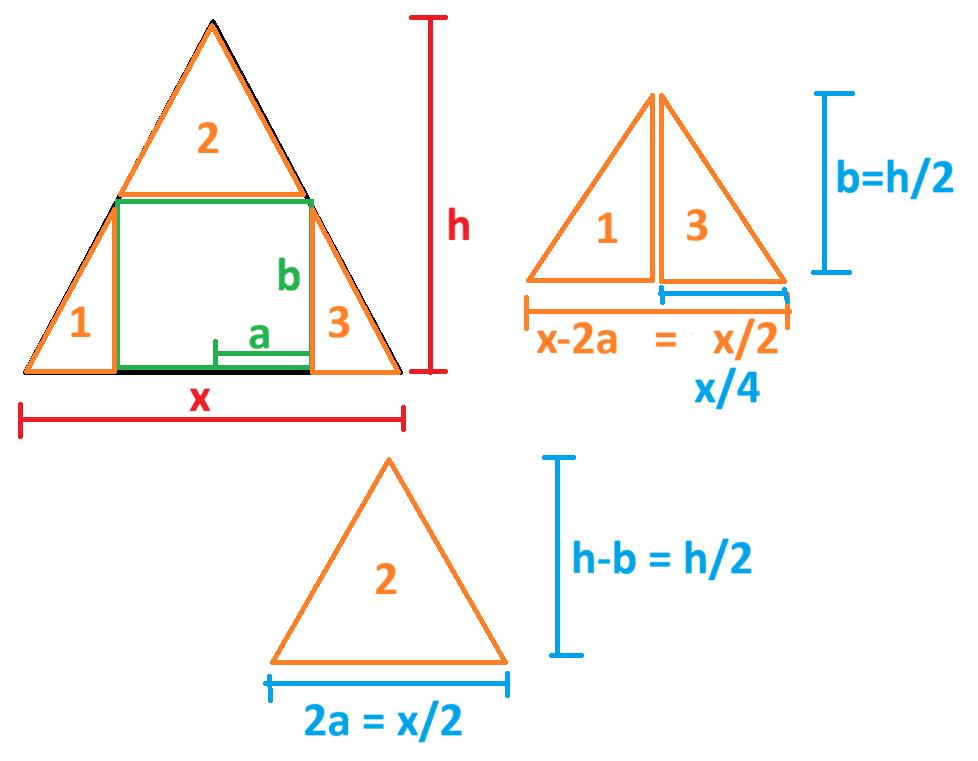
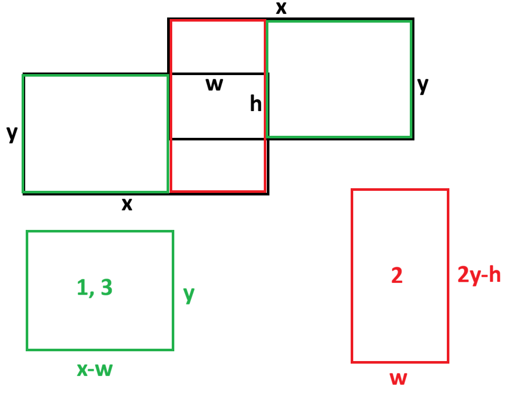

# Tarea Dev Junior - Ruuf

## 🎯 Objetivo

El objetivo de este ejercicio es poder entender tus habilidades como programador/a, la forma en que planteas un problema, cómo los resuelves y finalmente cómo comunicas tu forma de razonar y resultados.

## 🛠️ Problema

El problema a resolver consiste en encontrar la máxima cantidad de rectángulos de dimensiones "a" y "b" (paneles solares) que caben dentro de un rectángulo de dimensiones "x" e "y" (techo).

## 🚀 Cómo Empezar

### Opción 1: Solución en TypeScript

```bash
cd typescript
npm install
npm start
```

### Opción 2: Solución en Python

```bash
cd python
python3 main.py
```

## ✅ Casos de Prueba

Tu solución debe pasar los siguientes casos de prueba:

- Paneles 1x2 y techo 2x4 ⇒ Caben 4
- Paneles 1x2 y techo 3x5 ⇒ Caben 7
- Paneles 2x2 y techo 1x10 ⇒ Caben 0

---

## 📝 Tu Solución

[Link a Video](https://www.youtube.com/watch?v=I8M4nOdjNEc)

---

## 💰 Bonus (Opcional)

Si completaste alguno de los ejercicios bonus, explica tu solución aquí:

### Bonus Implementado

Bonus 1 y 2

### Explicación del Bonus

- Bonus 1: Triángulo Isóceles

La solución de este ejercicio se puede describir en encontrar la mayor cantidad de rectángulos dentro del triángulo entregado, para luego usar la función `calculate_panels` en cada uno de esos rectángulos y sumar todos los resultados obtenidos.

Para realizar lo anterior, se calculó como obtener las dimensiones del mayor rectángulo inscrito dentro de un triángulo, la cual se puede obtener usando triángulos semejantes de la siguiente manera:

<!--Aqui poner la foto de las dimensiones junto con los calculos -->



Luego de obtener ambas medidas del rectángulo interior dependiente de una sola variable, se procede a maximizar el resultado obtenido para encontrar el rectangulo de área máxima:

&rarr; `d(Area(a))/da = h - 4ah/x = 0 => a = x/4`

Pero como se estaba considerando la mitad del triángulo se multiplica por dos.
Dando como resultado que el rectángulo inscrito de área máxima tiene un ancho de `x/2` y un alto de `h/2`.

Notar que este resultado se obtiene para cualquier tipo de triángulo; en este ejemplo se realizó el cálculo para un triángulo isoceles, pero usando la mitad del triángulo isóceles como un triángulo rectángulo, para usar triangulos semejantes.

Ya teniendo las dimensiones del rectángulo inscrito, se verifica si el panel solar cabe en alguna posición. En caso de no caber se retorna la función entregando 0, pero en caso de que si cupiera se puede usar la función `calculate_panels` para obtener la mayor cantidad de paneles que puede tener esta porción del triángulo.

Luego queda ver las dimensiones de los 3 triángulos resultantes de extraer el primer rectángulo inscrito, estas dimensiones vienen dadas de la siguiente manera:

<!-- Foto de las dimensiones de los 3 triangulos resultantes -->



Aqui el problema se subdivide en dos casos, el caso de los 2 triángulos rectángulos y el triángulo isóceles; para este último bastaba con hacer recursión a la función dado que el resultado de extraer un nuevo rectángulo inscrito sería nuevamente dos triangulos rectángulos y un triángulo isóceles. Pero en el caso de los triángulos rectángulos el procedimiento es un poco diferente, dado que luego de extraer el rectángulo inscrito, da como extra solamente 2 triángulos resultantes, no 3.

Por tanto, para resolver esto se crearon dos funciones similares, donde una retorna recursivamente a 3 triángulos (caso isoceles), y la otra solo retorna los triángulos rectángulos.

- Bonus 2: Rectángulos Superpuestos

Dado que en este ejercicio se puede parametrizar el área superpuesta, se le otorgo un ancho y alto. Luego con esos valores se dividió la figura original en 3 rectángulos individuales que tienen las siguientes medidas:

<!-- Foto (~°°)~ -->



Ya teniendo las medidas de cada uno de los rectángulos, se puede volver a usar la función `calculate_panels` para cada uno de ellos.

---

## 🤔 Supuestos y Decisiones

Se asumió que el panel solar puede ir tanto horizontal como vertical, sin ángulos diferentes a 0° y 90°.

De la misma manera, se asumió que cada techo era completamente plano, al igual que los paneles.

- Bonus 2: Se asumió que tal como se ve en la figura ambos rectangulos son paralelos entre si, es decir, no tienen una diferencia en los ángulos de cada uno.

---

## Nota extra para bonus 1 y 2

Para ambos casos, creo que es posible encontrar un número mayor de paneles solares, esto debido a que en ambos casos se podría estar "desperdiciando" espacio, en especifico el espacio que podría sobrar al utilizar el primer algoritmo. Por ejemplo en el primer caso donde el techo es de 5x3 y el panel de 1x2 se pierde un espacio de 1x1.

En caso de que se pudiera redistribuir ese espacio para crear zonas donde más paneles se puedan agregar, se mejoraría un poco más este algoritmo. En ese caso creo que se deberia agregar más variables a los enunciados de las funciones.
